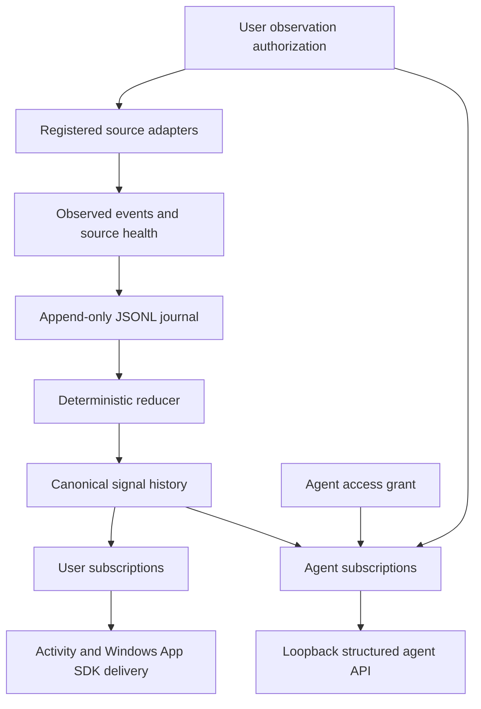

# Architecture overview

RFC 0001 is the normative source for semantics. This page explains the
implemented boundaries without restating the RFC as a second specification.

## Data flow

The important separation is:

1. **Observation authorization** answers whether a source may be observed.
2. **Observation and settling** produce bounded source facts.
3. **Reduction** turns eligible facts into canonical signals.
4. **Subscription matching** filters existing signal history.
5. **Delivery/read** exposes a matched projection to a user or agent.

Subscriptions are intentionally absent from signal creation. A subscription
cannot authorize a source or change the canonical history.

## Authority and derived state

The authoritative inputs are append-only JSONL records for application
registrations, observation authorization, source registrations/health, source
events, subscriber registrations, grants, subscriptions, reducer-policy
versions, and audited delivery attempts. Signal projections, current views,
application grouping, subscription indexes, agent stream indexes, and caches
are rebuildable derived state.

The durable `journal_sequence` is the primary local ordering boundary.
`runtime_epoch`, source epochs, snapshot/reconciliation identities, and the
versioned reducer policy make restart and source discontinuities explicit. A
replay cursor identifies a durable position and frontier metadata; replay
reconstructs state and does not execute external side effects.

## Sources and reduction

The qualified MVP includes bounded filesystem, process/job, UI Automation, and
explicit application/diagnostic adapters. Filesystem watcher activity is a hint
until settling. A degraded source remains fail-closed for ordinary signals
until deterministic reconciliation succeeds. Process/job observation is
limited to registered executable identities. UI Automation traversal is
bounded to authorized registered process surfaces and records physical-pixel
coordinate evidence where available.

The reducer is finite, deterministic, versioned, and reject-by-default. It
does not call a model, infer user intent, or treat a notification string as
canonical authority. An eligible event is reduced using authorization, source
reliability, application identity, prior signal state, and the exact policy
version.

## Runtime qualification

The accepted Windows qualification verified native Windows App SDK
`AppNotificationManager.Show()`, live registered process/job transitions, live
UI Automation window/dialog/control transitions with
`windows_virtual_screen_physical_px` coordinates, the five-page GUI journey,
filesystem-to-signal-to-delivery-to-agent flow, revocation returning 403, and
degradation/reconciliation recovery. See the
[runtime qualification record](../research/runtime-qualification.md).

## Normative and implementation references

- [RFC 0001](../rfc/RFC-0001.md) — normative semantics.
- [Schemas](../../schemas/index.json) — machine-readable
  contracts.
- [Architecture source note](architecture.md) —
  implementation component boundaries.
- [MVP completion checklist](../provenance/mvp-completion-checklist.md)
  — deterministic and runtime evidence.
