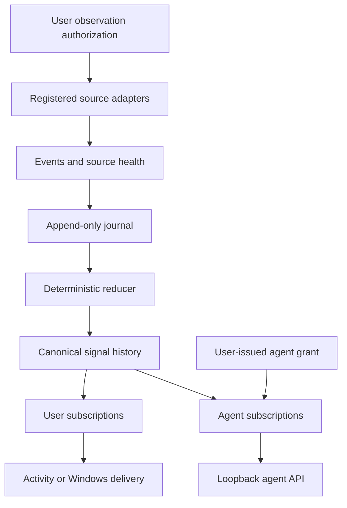

# Application Signals for Windows: Deterministic Signals for Bounded Asynchronous Desktop Workflows

## Abstract

Desktop applications expose asynchronous transitions such as file
stabilization, background-job completion, generated artifacts, dialogs, and
newly available operations. A user or software agent may know which operation
it started but still need repeated observation to learn when the next useful
state has arrived. Application Signals for Windows (ASW) is a bounded Windows
11 signal layer that converts explicitly authorized application, filesystem,
process/job, diagnostic, and UI Automation observations into deterministic
canonical signals. Signal creation is independent of subscriber presence.
Users and agents subscribe to an existing authorized signal history, while
agent reads are bounded by user-issued access grants. Windows App SDK
notifications are a delivery surface rather than the canonical data model.

The RFC 0001 implementation was runtime-qualified on Windows 11, including
native Windows App SDK delivery, registered process/job transitions, live UI
Automation observations with physical-pixel coordinates, deterministic journal
replay, source degradation/reconciliation, a five-page GUI, and bounded agent
list/read/stream/resume behavior. The accepted preregistered Phase 8 run used
controlled deterministic transition timelines and independent monotonic ground
truth; live OS qualification is reported separately. Across three primary
scenario classes, ASW achieved 100% detection with 0% duplicate
and false-positive useful-signal rates. Relative to the mechanically selected
best non-ASW baseline, `ordinary_notification`, ASW reduced median observation
effort by 50% in all three classes. In the bounded continuation layer, both
conditions achieved 100% continuation success; ASW reduced median observation
calls from two to one and median continuation latency from 40 ms to 20 ms.

These results support a bounded RFC 0001 MVP proposition: structured,
deterministic, application-associated signals can reduce observation effort
while preserving transition recognition and continuation in the controlled
Windows scenarios tested. They do not establish universal application
coverage, cross-platform behavior, production-scale reliability, or universal
benefit for arbitrary agents.

## 1. Motivation and research question

Asynchronous desktop work creates an information problem in addition to an
automation problem. A build may exit, an external file may become stable, a
render may finish, a dialog may appear, or an operation may become enabled
after the initiating action has returned. A consumer can poll, watch a
filesystem, parse a notification, or repeat a broad observation. Each approach
can add latency, duplicate interpretation, or tool calls, and each sees only a
particular surface of the application state.

ASW asks a narrower systems question:

> Can a local Windows service expose bounded, deterministic, application-
> associated transition signals that reduce unnecessary observation while
> preserving correct transition recognition and continuation?

The question is about information structure and authority boundaries, not about
whether ASW replaces application APIs, UI Automation, Windows notifications,
or an agent's task reasoning. The hypothesis for the controlled evaluation was
that structured ASW signals would reduce observation/tool effort without a
correctness regression under the preregistered scenarios and budgets.

The hypothesis is not itself an empirical result. The implementation evidence
establishes what the system can do; the Phase 8 run establishes what the frozen
protocol measured.

## 2. Design principles

### 2.1 Bounded observation authority

Users authorize what ASW may observe. Authorization can cover an application,
filesystem root, registered executable/job identity, UI Automation process
surface, or explicit application/diagnostic adapter contract. Subscriptions do
not expand that scope, and an agent cannot silently create authorization.

### 2.2 Canonical signals, not notification strings

The canonical product object is a typed signal with application identity,
category, kind, subject, source reliability, and frontier metadata where known.
Windows App SDK notification text is a user delivery representation. It is not
the source of truth and is not required for signal history or an agent read.

### 2.3 Deterministic reduction

The reducer is finite, versioned, reproducible, and reject-by-default. It does
not call a model, infer user intent, or turn an unsupported or degraded fact
into an ordinary signal. Source observations become signals only after the
relevant authorization, reliability, settling, correlation, and deduplication
rules are satisfied.

### 2.4 Explicit agent bounds

An agent's effective read scope is the intersection of its requested
subscription, active user-issued access grant, and user-authorized observation
universe. The service evaluates this intersection on each operation. A replay
cursor is a durable position, not an authorization token.

### 2.5 Replayable local authority

Append-only JSONL records are authoritative local inputs. Projections, indexes,
current views, and caches are rebuildable. Replay reconstructs state from the
journal, frontier metadata, authorizations, registrations, and reducer policy;
it does not re-execute processes, rewrite files, manipulate UI, or replay
external side effects.

## 3. Threat and authority model

ASW's primary threat boundary is accidental or unauthorized expansion of what
the service observes or what an agent can read. The design therefore separates
four questions:

1. **May ASW observe this surface?** User observation authorization answers this
   question.
2. **What narrow fact did a source report?** A registered adapter emits an
   event with source identity and reliability.
3. **Does the fact become canonical signal history?** The deterministic reducer
   applies the authorized, versioned policy.
4. **Who may see the existing signal?** User or agent subscription matching
   applies after signal creation; agent access is checked again at the service
   boundary.

This is a local authority model, not a remote multi-user security protocol.
The reference agent transport binds to loopback and receives a bearer token
from the user grant flow. The token is a local credential. The journal may
contain paths and application metadata and therefore requires ordinary local
account and filesystem protection.

The model explicitly excludes cloud isolation, arbitrary desktop interception,
universal application semantics, and general sandboxing. These exclusions are
part of the scope of the result, not claims that the system solves those
problems.

## 4. System architecture

The implemented flow is:



The source layer includes bounded filesystem, process/job, UI Automation, and
explicit application/diagnostic adapters. Filesystem watcher activity is a
hint until settling and reconciliation. A degraded source is not promoted to
healthy until deterministic reconciliation completes. The process/job adapter
is limited to registered executable identities. The UI Automation adapter
limits traversal to eligible registered process surfaces and retains physical
coordinate and uncertainty information where available.

The service journal records application registrations, observation
authorizations, source registrations and health, source events, subscriber
registrations, grants, subscriptions, reducer-policy versions, and audited
delivery attempts. Signal history, grouped Activity views, subscription match
indexes, and agent stream indexes are derived projections. The durable
`journal_sequence` is the primary local ordering boundary; `runtime_epoch` and
source epochs make restart and source discontinuity explicit.

The GUI exposes Activity, Subscriptions, Applications, Sources & Permissions,
and Agents. The local structured agent facade exposes capabilities, application
and subscription snapshots, subscription mutation, signal list/get, and
schema-versioned stream/resume operations. Neither view is a competing source
of truth.

## 5. Deterministic signal model

An event is a source fact about an observed environmental transition. A signal
is a structured record created from an eligible event or correlated event group
after validation, authorization, settling, and deduplication. A typical signal
identifies an application, category, event kind, subject, source reliability,
and the frontier at which the service accepted it.

The reducer can be described as:

```text
event
+ observation authorization
+ source reliability
+ application identity
+ prior signal state
+ reducer policy version
-> signal update, no-op, or source-health signal
```

Subscription state is deliberately absent from this equation. This preserves
the invariant that creating, changing, or deleting a subscription cannot create
or remove canonical signal history. Unsupported event types, invalid schemas,
unauthorized sources, hint-only facts, and degraded facts fail closed for
ordinary signal creation.

Correlation and deduplication are deterministic. Multiple source observations
may remain in the journal without producing duplicate useful signals. A
stable-file transition, for example, is promoted only after the configured
settle profile is satisfied. The reducer does not claim that the application
has completed an arbitrary user task; it records the narrow supported fact.

## 6. Windows observation and delivery

Runtime qualification verified the Windows-specific boundaries rather than
substituting synthetic unit fixtures for them. The accepted record reports:

- native Windows App SDK `AppNotificationManager.Show()` success;
- registered process start and success/failure exit transitions;
- registered job success/failure transitions where an executable binding is
  available;
- live UI Automation observations for a top-level window, modal dialog, and
  enabled control with `windows_virtual_screen_physical_px` coordinates;
- the five-page GUI smoke journey;
- an authorized filesystem transition becoming a canonical signal, being
  delivered through the native notification channel, and being read through
  the agent facade;
- grant revocation producing HTTP 403 on subsequent access; and
- filesystem degradation remaining fail-closed until reconciliation restored
  health.

Windows notifications are optional delivery. A failed send is audited and does
not mutate or delete the canonical signal. The Windows App Runtime is an OS
prerequisite separate from the Python projection packages.

## 7. Evaluation methodology

### 7.1 Frozen protocol

The accepted run is `asw-mvp-eval-20260802-05`, based on core commit
`7d6e267c6e89cdcd8a71644c67c95d2ab4260330` and profile digest
`sha256:9c38bd41057e1933cda9c54c26fa143f775d7e6bbb5cd2848423ccd7cebeb1c7`.
The profile froze scenario versions, seed `20260802`, random transition delays
from 500 ms (inclusive) to 2000 ms (exclusive), i.e. 500–1999 ms, a 250 ms
polling interval, a 15,000 ms deadline, baseline contracts, agent
configuration, repetition counts, selection rule, and thresholds before
comparative runs.

### 7.2 Controlled transition timelines and independent ground truth

The Phase 8 controller used deterministic `ControlledProbe` timelines with
separate truth and public-observation methods for bounded job,
external-file/artifact, UI modal/control, render/export, and crash/restart
scenarios. These probes are not live OS process, filesystem, or UI Automation
qualification. The ASW condition passed the probe's controlled source event
through the committed public `ASWService.emit_event` boundary and read the
result through `AgentAPI.open_signal_stream`; it did not inject a benchmark-
only canonical signal record. Live Windows source and delivery behavior is
covered separately by the runtime qualification described in section 6.

An independent monotonic ground-truth channel recorded the transition before
each condition and was not passed to the observers under test. This separates
the fact that a controlled transition occurred from the mechanism used to
discover it.

The evaluation used controlled deterministic transition timelines. Primary
classes were job completion, file/artifact transition, and UI transition.
Secondary probes covered render/export-style output and
crash/restart. Conditions included polling, filesystem watch where applicable,
ordinary notification text, repeated observation, and ASW. Non-applicable
pairs were persisted explicitly rather than silently treated as successes.

### 7.3 Layer A

Layer A was a model-free systems benchmark with **zero model calls**. Layer A
used zero model calls. It
measured detection, latency, observation count, misses, duplicates, false
positives, application attribution, event-kind accuracy, subject/localization
where applicable, and continuation readiness. Primary classes used 20
repetitions; secondary classes used 10.

### 7.4 Baseline selection

For each primary class, the best non-ASW baseline was selected mechanically by
highest detection success, lowest miss rate, lowest median observation count,
lowest median detection latency, then lexical condition ID. The selection
result was `ordinary_notification` for file/artifact, job, and UI classes. The
paper reports that selection rather than choosing a comparator after looking at
the headline result.

### 7.5 Layer B

Layer B used three repetitions per primary scenario. Each primary class
contained two primary scenarios, so each condition contributed six Layer B
trials per primary class. It compared ASW only with the selected baseline.
The compared conditions used the same fixed configuration, a maximum of two
observation calls, and one continuation call. The frozen
`ScriptedContinuationAgent` assigned normalized benchmark values from the
structured subject: the structured ASW path received one observation call and
20 ms of continuation latency, while the plain-text notification path received
two calls and 40 ms. These are scripted protocol values, not independently
measured OS execution latency; they quantify the frozen continuation policy.
Layer B is therefore a bounded continuation configuration, not an external LLM
evaluation, and the run makes no external-LLM generalization claim.

For Layer B, an observation call means one result read from the ASW signal
stream or one notification receipt-and-parsing operation under the frozen
observer contract. Subscription setup and controlled event publication are
excluded from that count.

### 7.6 Integrity and invalidation

The final run contains 736 raw trial records, 158 independent ground-truth
records, and 36 agent-usage records. Authorization and replay violation counts
are zero. Layer A model calls are zero. Technical invalidated runs were
retained with their invalidation records and excluded from the accepted
classification; they were not silently deleted or rewritten.

## 8. Results

### 8.1 Headline table

| Metric | ASW result |
|---|---:|
| Detection | 100% |
| Duplicate useful-signal rate | 0% |
| False-positive useful-signal rate | 0% |
| Application attribution accuracy | 100% |
| Event-kind accuracy | 100% |
| Primary classes meeting efficiency gate | 3/3 |
| Median observation reduction vs selected baseline | 50% |
| Layer B continuation success | 100% |
| Layer B observation-call improvement | 50% |
| Layer B continuation-latency improvement | 50% |

### 8.2 Primary class comparison

The selected non-ASW baseline was `ordinary_notification` in every primary
class. ASW and the selected baseline both detected the controlled transitions;
the difference in this table is median observation count under the frozen
protocol.

| Primary class | ASW median observations | Selected baseline | Baseline median observations | Reduction |
|---|---:|---|---:|---:|
| File/artifact transition | 1 | `ordinary_notification` | 2 | 50% |
| Job completion | 1 | `ordinary_notification` | 2 | 50% |
| UI transition | 1 | `ordinary_notification` | 2 | 50% |

### 8.3 Layer B continuation

| Condition | Continuation success | Median observation calls | Median continuation latency |
|---|---:|---:|---:|
| ASW | 100% | 1 | 20 ms |
| `ordinary_notification` | 100% | 2 | 40 ms |

The Layer B result is therefore a bounded efficiency comparison with no
success regression in this run. It is not evidence that arbitrary agents will
observe the same latency or benefit.

## 9. Interpretation

The primary result supports the architectural proposition that structured,
application-associated signals can let a consumer reach the same correct
continuation state with fewer observations in the tested workflows. The result
is about information structure and access to a canonical signal, not a claim
that ordinary notifications are ineffective or that ASW is more correct than
every alternative. Ordinary notification text was the strongest non-ASW
comparator under the frozen selection rule and also achieved 100% continuation
success in Layer B.

The evidence separates four levels of statement:

- **RFC specified:** the authority model, signal/subscription separation,
  deterministic reducer, journal/replay boundary, and local agent contract.
- **Implementation demonstrated:** the committed source/tests implement the
  GUI, sources, reducer, journal, grant enforcement, and structured facade.
- **Runtime verified:** the accepted Windows qualification exercised the native
  source/delivery and GUI boundaries.
- **Empirically supported:** the accepted controlled Phase 8 run produced the
  tables in this section.

The paper makes no new normative requirements. It explains the existing RFC
and evidence boundary.

## 10. Limitations and threats to validity

- The implementation and qualification are bounded to a Windows 11 MVP and do
  not establish cross-platform behavior.
- The probes are controlled transitions, not a representative population of
  third-party applications or long-running production workloads.
- Coverage depends on explicit registration, observation authorization, adapter
  contracts, source health, and the frozen contracts/budgets.
- The selected baseline and its result depend on the preregistered selection
  rule and ordinary-notification contract.
- Layer B used a small deterministic/normalized continuation agent. It does
  not establish benefit for external LLMs, arbitrary tools, or general agent
  workloads.
- The experiment does not establish population-level effect sizes, universal
  application coverage, universal agent benefit, or production-scale
  reliability.
- The secondary crash/restart ASW result recorded `subject_accuracy = 0.0`.
  This did not affect the primary hard gate, but it is a material negative
  result and a follow-up limitation.
- Local journals can contain paths and application metadata; the experiment's
  reproducibility artifacts require ordinary secret and machine-path review
  before broader publication.

## 11. Reproducibility

The release package provides a sanitized [run manifest](../provenance/accepted-run-manifest.json),
[evidence summary](../provenance/release-evidence-summary.md), [accepted
aggregate](../provenance/accepted-aggregate.json), and [claims matrix](claims-and-evidence.md).
The complete frozen run directory is retained unchanged in the release
engineering evidence archive and was verified before construction-workspace
archival; raw machine-metadata-bearing records are excluded from the public
artifact.

To reproduce from a source checkout, use the published source archive or the
configured repository origin and select the proposed release revision:

```powershell
git clone https://github.com/paragon-ux/ASW.git ASW
Set-Location .\ASW
git checkout v0.1.0
```

If the origin is access-restricted, use the corresponding `v0.1.0` source
release archive. The evaluation harness is included in this repository and is
not a separately installed PyPI dependency.

From that package, the accepted validation path is:

```powershell
python -m evaluation.validate
python -m unittest discover -s evaluation/tests -q
python -m evaluation.validate --run evaluation/results/asw-mvp-eval-20260802-05
python tools\verify_frozen_evidence.py --evaluation-root <immutable-evidence-bundle>
```

The verification helper validates the accepted directory read-only, recomputes
the aggregate from the frozen profile, independent ground truth, and raw
results in an isolated temporary copy, and compares it byte-for-byte with the
accepted aggregate. Invalidated runs `asw-mvp-eval-20260802-01` through `-04`
remain available with their invalidation records.

Primary internal references are [RFC 0001](../rfc/RFC-0001.md), the [runtime
qualification](runtime-qualification.md), the [sanitized accepted evaluation
report](evaluation-results.md), and the [frozen aggregate](../provenance/accepted-aggregate.json).

## 12. Related design space

ASW sits between source-specific observation mechanisms and consumer-side task
reasoning. Polling and repeated observation remain useful fallbacks but can
require multiple reads. Filesystem watches can provide timely hints for file
transitions but do not by themselves encode application-associated canonical
semantics. Ordinary notifications can be a strong comparator when their text
contract is stable, but notification delivery remains a representation rather
than a replayable structured history.

UI Automation and application-native APIs remain important observation or
semantic sources. ASW does not replace them; it bounds their authorized use and
reduces eligible facts into a common signal history. The point of the design is
to make authority and evidence explicit across these surfaces, not to claim a
universal replacement or cross-platform abstraction.

## 13. Conclusion

RFC 0001 defines a local Windows architecture in which user-authorized
observations are reduced into deterministic application signals before user or
agent subscriptions and delivery. The implementation and runtime qualification
establish the GUI-first, source, journal/replay, Windows delivery, and bounded
agent-access boundaries. The accepted controlled evaluation supports the
narrower empirical proposition that, in the three tested primary classes, ASW
reduced median observation effort by 50% versus the mechanically selected
ordinary-notification baseline while preserving transition recognition and
bounded continuation success.

That is a useful but bounded result. Broader application coverage,
cross-platform operation, production-scale reliability, and arbitrary-agent
benefit remain open questions. The release candidate therefore treats the
authority model, deterministic evidence path, and stated limitations as part
of the contribution rather than extending the claims beyond the data.
